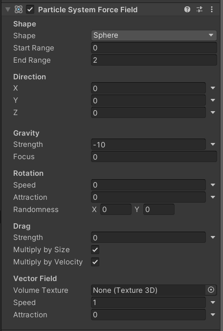
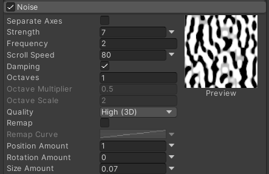

# Documentación de la evidencia evaluativa de la unidad

## Enlace al video en YouTube
https://youtu.be/aQxcOPiGpn8

## Explicación de la solución
## The challenge
This time, I was meant to add a partycle system to the environment using trails, noise, rotations, collisions and other stuff while it being interactive. Do you remember my spacecraft from the previous unit? Well, if you don't, the important thing is that it carries around a metallic object attached to it by a spring-like conection. That object, that works similar to a wrecking ball, can be dragged by the user with the cursor. I wanted to add here the partycle system so when the user drags the ball, lightning bolts start to be spread by the object, like it's malfunctioning or highly energetic. I also wanted the spacecraft to be safe from this electric rain, so I wanted to attach it a force field.

## The solution
To make this work, I had to use the Unity's integrated partycle system, based on the concept of a whole system of objects that behave within the same restriccions and limits while also beign somewhat independent; they behave like a system, but not like the same thing. I also needed to use the concept of force fields, which, in this case is a component that exerts forces on particle systems. This can either attract or repel them, for the purpose of the spacecraft being able to ignore those particles, I had to repel them. 

I also used the concept of collisions, so that the particles can interact with the environment, like they bouncing off the Earth if they were to hit it, and I also added the gravity component so that the partycles are pulled downward. Lastly, to make this system look like lightning bolts instead of just some random dots falling I had to use the Trails and Noise components. The former is very self-explanatory, it creates a trail that follows the particle. The latter is a bit more complex, since it adds some randomness to the way the particles spawn and behave throughout their lifetime. I modified its values to make the particles move really, reaaly fast (the noise map moves with a high frequency) and change their directions drastically, so the trails can look like that characteristic edgy movement of a lightning.

