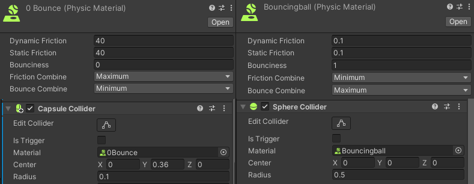

# Documentación de la evidencia evaluativa de la unidad

## Enlace al video en YouTube
[https://youtu.be/aQxcOPiGpn8](https://youtu.be/FJNWutHpqu4)


## Explicación de la solución
## The challenge
For this challenge I had a BUNCH of stuff to add. 
1. Raycasts (eyes for the creatures).
2. "The mess", chaos created by particle systems and its collisions.
3. Wind physics for those particles.
4. FixedJoints (a component that connects an object to other or to a position until a certain force threshold is reached).
5. SpringJoints (a component that connects two objects together and behaves like a spring).
6. HingeJoints Ropes (a component that ties two objects. Apllying this between a series of several objects make them behave like a rope).
7. Physics Materials (an object type that determines physical aspects of a collider, like the friction or the bounicness of a material).

## The solution
So, how to add all of this to my narrative? EZ. I added a sh!t ton of new creatures. I added rockets that look for the spacecraft (with raycasts) and want to obliterate it. 

```c#
void Update()
    {
        // Creates a ray that starts just above the cube to prevent the raycast from hitting the cube itself
        Ray ray = new Ray(transform.position + transform.up * 1f, transform.up);

        // Casts the raycast upward
        RaycastHit hit;
        if (Physics.Raycast(ray, out hit))
        {
            // If the raycast hits an object with the name "Beg"
            if (hit.collider.gameObject.name == "Beg")
            {
                // Starts moving towards the "Beg" object
                isMoving = true;
                // Calculates the direction towards the "Beg" object
                direction = (hit.collider.gameObject.transform.position - transform.position).normalized;
            }
        }

        // If the cube is moving
        if (isMoving)
        {
            // Adds force to the Rigidbody in the direction of the "Beg" object
            rb.AddForce(direction * speed);
        }
        else
        {
            // Rotates the cube on the Z axis
            transform.Rotate(0, 0, speedRot * Time.fixedDeltaTime);
        }
    }
```


For "The mess" I added a rain made up of shooting stars that collide with everything (which is also affected by wind). 


The fixed joints are used on some rockets to lock them on a position for a while, so it looks like they need to charge and prepare before looking for the spacecraft. 


The spring joints allowed me to create Wormlings, little worm-like creatures, children of the Gigantic Hyperspace Raging Worm-like Creature, they are made of spheres tied by spring joints alone, and the head moves with a Perlin noise function, so the body follows. 


There are a lot of creatures that want our spacecraft to die, so why not give it something to defend itself? I used hinge joints (ropes) to create a chain tied to the bottom of the spacecraft, made by a bunch of capsules tied to each other, and I added another wrecking ball to the end of this chain. I made the spacecraft able to rotate on the Z axis, so it can swing around its new weapon. 


Lastly, I used two physics materials, one that makes objects really bouncy and one with objects with a lot of friction and bounciness. I added the first one to the spacecraft (poor little thing), so if a spacecraft crushes it, it's done, it will go flying to hyperspace. I added the second one to the rockets to magnify that effect.


