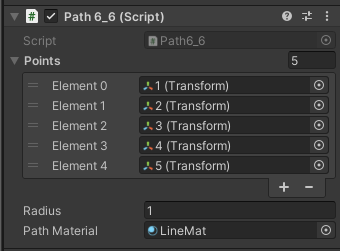

# Documentación de la evidencia evaluativa de la unidad

## Enlace al video en YouTube
https://youtu.be/zNyrT9GrLrI

## Explicación de la solución
## The challenge
So, as you can tell, this unit is called autonomous agents, and that's exactly my task: to create autonomous creatures with steering behaviours that interact with their environment and with each other, knowing where to face and to move to next.

I'm feeling quite oceanic, so now I wanted to add spacial shark-like creatures. I wanted to divide them on two groups, a few of them will follow an stablished path via steering and forces, while the other will be a massive shoal that behaves like one entity, and I wanted them to spawn if I clicked on the scene. I also wanted the shoal to change its behaviour over time.

## The solution
### 1. The path followers
To make this creatures, I didn't want them to strictly follow a path crerated by points on the editor, that'd be boring. I wanted them to feel attracted to the path and try to follow it as much as they can, but mantaining a nearly constant acceleration on the X axis. To make this happen, I had to create mainly three things.

First, the script attached to each shark, which will be in charge of their ability to seek the path:

```c#
public void Seek(Vector2 target)
    {
        // Get a vector pointing from our location to the target.
        Vector2 desired = target - body.position;
        // Scale our desired vector by our maximum speed.
        desired = desired.normalized * maxspeed;

        // Apply Reynold's path following force relative to time.
        Vector2 steer = desired - body.velocity;
        body.AddForce(steer * Time.fixedDeltaTime, ForceMode2D.Impulse);
    }
```

And then to follow the path:
```c#
public void FollowPath(Path6_6 path)
    {
        // Predict the future location of the body.
        Vector2 predictedLocation = body.position + body.velocity.normalized * 2.5f;

        float distanceRecord = float.MaxValue;
        Vector2 recordTarget = Vector2.zero;
        // Look at each segment and find the closest normal point.
        for (int i = 0; i < path.points.Length - 1; i++)
        {
            Vector2 a = path.points[i].position;
            Vector2 b = path.points[i + 1].position;
            Vector2 normalPoint = GetNormalPoint(predictedLocation, a, b);
            // If the normal point is beyond the line segment, clamp it to the endpoint.
            if (normalPoint.x > b.x || normalPoint.x < a.x)
            {
                normalPoint = b;
            }

            // If this point is closer than any previous point, update the record.
            float distance = Vector2.Distance(predictedLocation, normalPoint);
            if (distance < distanceRecord)
            {
                distanceRecord = distance;
                recordTarget = normalPoint;
            }
        }

        // Is the vehicle predicted to leave the path?
        if (distanceRecord > path.radius)
        {
            // If so, steer the vehicle towards the path.
            Seek(recordTarget);
        }
    }
```

Then I created a path that is a connection of an arbitrary number of points previously designated on the editor. You can put them wherever you want and you can use as many as you want, and when hitting space you can toggle the vision of the line renderer of the path.

Then I had to create a big script to manage the whole behaviour, this script will first instantiate the number of sharks you want, I called them vehiucles on the script:

```c#
void Start()
    {
        FindWindowLimits();

        // Spawn the vehicles into the scene.
        vehicles = new Vehicle6_6[vehicleCount];
        for (int i = 0; i < vehicleCount; i++)
        {
            // Create a new vehicle in front of the track.
            GameObject vehicle = Instantiate(vehiclePrefab, spawn.position, Quaternion.identity);
            //vehicles[i].transform.rotation = vehicle.transform.rotation.eulerAngles;

            // Assign initial velocity and max speed values for each vehicle.
            vehicles[i] = vehicle.GetComponent<Vehicle6_6>();
            vehicles[i].body.velocity = Vector3.right * 10;
            //vehicles[i].body.rotation = 2f;
            vehicles[i].maxspeed = Random.Range(minSpeed, maxSpeed);

            vehicle.transform.SetParent(newParent.transform);
        }
    }
```

And lastly each frame it will run some calculations and call the FollowPath() function of each shhark:

```c#
void FixedUpdate()
    {
        foreach (Vehicle6_6 vehicle in vehicles)
        {
            // When the vehicle passes the right edge, wrap back to the left edge.
            if (vehicle.transform.position.x > maximumPos.x)
            {
                vehicle.transform.position = new Vector3(
                    -maximumPos.x,
                    vehicle.transform.position.y,
                    vehicle.transform.position.z
                );
            }
            // Attempt to follow the path.
            vehicle.FollowPath(path);
        }
    }
```


And here's the path with its list of points on the editor (transforms):



### 2. The shoal

To make this work I had to consider 5 main parameters I wanted my creatures to be based on:

1. Separation Scale (steer to avoid colliding with your neighbors).
2. Cohesion Scale (steer towards the center of your neighbors, stay with the group).
3. Alignment Scale (steer in the same direction as your neighbors).
4. Maximum Forces applied to each shark.
5. Maximum Speed of each shark.

The first three are based on the same principle: find an average value on creatures over a certain distance and do something about it. Separation finds the position and future direction of the other sharks and tries not to collide with others. Cohesion finds the position and future direction of the others and tries to move towards the same point. Alignment fintds the future direction of others and adjusts one's direction.

Working like this on code:

```c#
   public Vector2 Align(List<Boid> boids)
    {
        float neighborDist = 6f; // This is an arbitrary value and could vary from boid to boid.

        /* Add up all the velocities and divide by the total to
         * calculate the average velocity. */
        Vector2 sum = Vector2.zero;
        int count = 0;
        foreach (Boid other in boids)
        {
            float d = Vector2.Distance(location, other.location);
            if ((d > 0) && (d < neighborDist))
            {
                sum += other.velocity;
                count++; // For an average, we need to keep track of how many boids are within the distance.
            }
        }

        if (count > 0)
        {
            sum /= count;

            sum = sum.normalized * maxSpeed; // We desire to go in that direction at maximum speed.

            Vector2 steer = sum - velocity; // Reynolds's steering force formula.
            steer = Vector2.ClampMagnitude(steer, maxForce);
            return steer;
        }
        else
        {
            return Vector2.zero; // If we don't find any close boids, the steering force is Zero.
        }
    }

    public Vector2 Cohesion(List<Boid> boids)
    {
        float neighborDist = 6f;
        Vector2 sum = Vector2.zero;
        int count = 0;
        foreach (Boid other in boids)
        {
            float d = Vector2.Distance(location, other.location);
            if ((d > 0) && (d < neighborDist))
            {
                sum += other.location; // Adding up all the other's locations
                count++;
            }
        }
        if (count > 0)
        {
            sum /= count;
            /* Here we make use of the Seek() function we wrote in
             * Example 6.8. The target we seek is the average
             * location of our neighbors. */
            return Seek(sum);
        }
        else
        {
            return Vector2.zero;
        }
    }

    public Vector2 Separate(List<Boid> boids)
    {
        Vector2 sum = Vector2.zero;
        int count = 0;

        float desiredSeperation = myVehicle.transform.localScale.x * 2;

        foreach (Boid other in boids)
        {
            float d = Vector2.Distance(other.location, location);

            if ((d > 0) && (d < desiredSeperation))
            {
                Vector2 diff = location - other.location;
                diff.Normalize();

                diff /= d;

                sum += diff;
                count++;
            }
        }

        if (count > 0)
        {
            sum /= count;

            sum *= maxSpeed;

            Vector2 steer = sum - velocity;
            steer = Vector2.ClampMagnitude(steer, maxForce);


            return steer;
        }
        return Vector2.zero;
    }
```

All of this are methods of a class called Boid, which is the parent from all of the sharks. This class works like this:

```c#
class Boid
{
    // To make it easier on ourselves, we use Get and Set as quick ways to get the location of the vehicle
    public Vector2 location
    {
        get { return myVehicle.transform.position; }
        set { myVehicle.transform.position = value; }
    }
    public Vector2 velocity
    {
        get { return rb.velocity; }
        set { rb.velocity = value; }
    }

    public float maxSpeed, maxForce;
    public float separationScale, cohesionScale, alignmentScale;
    private Vector2 minPos, maxPos;
    private GameObject myVehicle;
    private Rigidbody rb;

    public Boid(Vector2 initPos, Vector2 _minPos, Vector2 _maxPos, float _maxSpeed, float _maxForce, Mesh coneMesh, float _separationScale, float _cohesionScale, float _alignmentScale, GameObject newParent, Material fishMat)
    {
        minPos = _minPos;
        maxPos = _maxPos;
        maxSpeed = _maxSpeed;
        maxForce = _maxForce;
        separationScale = _separationScale;
        cohesionScale = _cohesionScale;
        alignmentScale = _alignmentScale;

        myVehicle = GameObject.CreatePrimitive(PrimitiveType.Cube);
        Renderer renderer = myVehicle.GetComponent<Renderer>();
        renderer.material = fishMat;
        renderer.material.color = Color.blue;
        Object.Destroy(myVehicle.GetComponent<BoxCollider>());

        myVehicle.transform.position = new Vector2(initPos.x, initPos.y);

        myVehicle.AddComponent<Rigidbody>();
        rb = myVehicle.GetComponent<Rigidbody>();
        rb.constraints = RigidbodyConstraints.FreezeRotation;
        rb.constraints = RigidbodyConstraints.FreezePositionZ;
        rb.useGravity = false; // Remember to ignore gravity!

        myVehicle.transform.SetParent(newParent.transform);

        myVehicle.name = "Fish";

        float randScale = Random.Range(0.3f, 1.8f);

        myVehicle.transform.localScale = new Vector3(randScale, randScale, randScale);


        /* We want to double check if a custom mesh is
         * being used. If not, we will scale a cube up
         * instead ans use that for our boids. */
        if (coneMesh != null)
        {
            MeshFilter filter = myVehicle.GetComponent<MeshFilter>();
            filter.mesh = coneMesh;
        }
        else
        {
            myVehicle.transform.localScale = new Vector3(1f, 2f, 1f);
        }
    }
}
```

And has this methods (as well as the three listed above):

```c#
    private void LookForward()
    {
        /* We want our boids to face the same direction
         * that they're going. To do that, we take our location
         * and velocity to see where we're heading. */
        Vector2 futureLocation = location + velocity;
        myVehicle.transform.LookAt(futureLocation); // We can use the built in 'LookAt' function to automatically face us the right direction

        /* In the case our model is facing the wrong direction,
         * we can adjust it using Eular Angles. */
        Vector3 euler = myVehicle.transform.rotation.eulerAngles;
        myVehicle.transform.rotation = Quaternion.Euler(euler.x + 360, euler.y + 0, euler.z + 30); // Adjust these numbers to make the boids face different directions!
    }

    public void Flock(List<Boid> boids)
    {
        Vector2 sep = Separate(boids); // The three flocking rules
        Vector2 ali = Align(boids);
        Vector2 coh = Cohesion(boids);

        sep *= separationScale; // Arbitrary weights for these forces (Try different ones!)
        ali *= alignmentScale;
        coh *= cohesionScale;

        ApplyForce(sep); // Applying all the forces
        ApplyForce(ali);
        ApplyForce(coh);

        CheckEdges(); // To loop the world to the other side of the screen.
        LookForward(); // Make the boids face forward.
    }

    public Vector2 Seek(Vector2 target)
    {
        Vector2 desired = target - location;
        desired.Normalize();
        desired *= maxSpeed;
        Vector2 steer = desired - velocity;
        steer = Vector2.ClampMagnitude(steer, maxForce);

        return steer;
    }

    public void ApplyForce(Vector2 force)
    {
        rb.AddForce(force);
    }
```

Now, let us remember that I wanted them to spawn if you cliked on the screen, so, this is the starting values and the basic creation of 100 creatures:

```c#
void Start()
    {
        FindWindowLimits();
        boids = new List<Boid>(); // Initilize and fill the List with a bunch of Vehicles
        for (int i = 0; i < 100; i++)
        {
            float ranX = Random.Range(-1.0f, 1.0f);
            float ranY = Random.Range(-1.0f, 1.0f);
            boids.Add(new Boid(new Vector2(ranX, ranY), -maximumPos, maximumPos, maxSpeed, maxForce, coneMesh, separationScale, cohesionScale, alignmentScale, newParent, boidMaterial));

        }
    }
```

And to make the five parameters listed above change over time I used a sine function, visible on the scen via a white spehre that changes its Y position wit this sine values. I applied different modifiers to each parameter (for maxSpeed and maxForce I used the same one) so it behaved better and could be more felxible and interactive, being versatile and modular.

```c#
void Update()
    {
        Vector2 mousePos = Input.mousePosition;
        mousePos = Camera.main.ScreenToWorldPoint(mousePos);

        foreach (Boid v in boids)
        {
            v.Flock(boids);
            v.separationScale = sinV * sinMultSepar;
            v.cohesionScale = sinV * sinMultCohe;
            v.alignmentScale = sinV * sinMultAli;
            v.maxForce = sinV + maxForce * 1.3f;
            v.maxSpeed = sinV + maxSpeed * 1.3f;

        }

        if (Input.GetMouseButton(0))
        {
            boids.Add(new Boid(mousePos, -maximumPos, maximumPos, maxSpeed, maxForce, coneMesh, separationScale, cohesionScale, alignmentScale, newParent, boidMaterial));          
        }

        sinV = (amplitude * (Mathf.Sin(2 * Mathf.PI * frequency * time) + 1));

        // increment time to animate the sine wave
        time += Time.fixedDeltaTime;

        sphere.transform.position = new Vector3(-6.85f,sinV,0);
    }
```
So, when the sine function is on high values, the creatures move faster and behave more like the others, like the shoal, while when the funcion is on low values they move slower and don't apply as much forces equals to others. You can change the frequncy and amplitude of the sine function at will, being really modular and following a period-like behaviour.


And that's all for this simulation, I hope it was somewhat useful for you.
