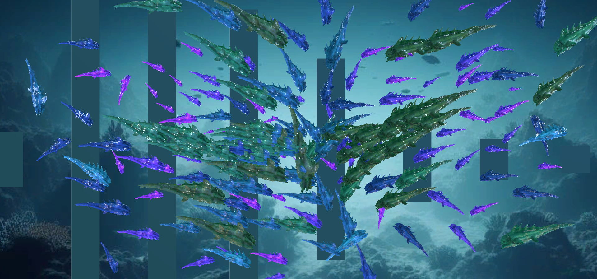
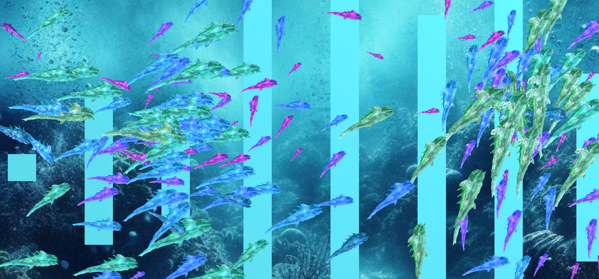

# Documentación de la evidencia evaluativa del proyecto final

## Enlace al video en YouTube

## High Water: 

[Reactive music video for High Water by Sleep Token](https://youtu.be/XTltszDMAzI)



## Fall For Me:
[Reactive music video for Fall For Me by Sleep Token](https://youtu.be/qKhEGD9c0n4)



## Explicación de la solución

For this project, I was tasked with creating a music video that leverages simulation techniques and concepts from previous units. The video needed to be reactive to the music and maintain a clear design concept throughout.

I knew from the outset that I wanted to feature a track from Sleep Token, my favourite band of all time. Their second album, "This Place Will Become Your Tomb", resonates deeply with me. I decided to align my concept with the narrative of the album.

In the lore of the band, this album depicts the struggle of Vessel, the protagonist, who attempts to end his life due to a tumultuous and exploitative relationship with Sleep, an ancient deity. Sleep grants him power but at the cost of dependency and increasing sacrifices. The album explores themes of battling against overwhelming odds and the eventual acceptance of one's fate.

The album's imagery is heavily influenced by the ocean, with each song's cover art featuring marine creatures and an overall aesthetic that evokes the sensation of being underwater.

My vision for the video was to capture this duality - the awe-inspiring power granted by the entity contrasted with the oppressive darkness from which it originates. To achieve this, I selected two songs from the album: 'Fall For Me' and 'High Water'.

Without delving too deep into their narratives, 'Fall For Me' represents a longing for the love and power that has brought you so far, despite its costs. 'High Water', on the other hand, signifies acceptance of your role as a guardian of a dark entity, understanding that there's no turning back.

To visually represent these themes, I envisioned a vibrant shiver of sharks in various colours and sizes, nearly dancing to the rythm of the song. 

I applied the concept of Perlin Noise, explain on previous units, to create a slow random-moving camera that shakes rapidly following the bass and low frequencies of the song. For that, the package Cinemachine gives me the chance to use a noise based on Perlin noises' calculations. Now, I'll have to explain how I made the program to react with the audio.

At first, I created a method that gets the spectrum of a component called an Audio Source, which helds the .wav file of the songs:

```c#
void GetSpectrumAudioSource()
    {
        audioSource.GetSpectrumData(samples, 0, FFTWindow.Blackman);
    }

```
I used the GetSpectrumData() function, which provides a block of the currently playing audio source's spectrum data. The array given in the samples parameter will be filled with the requested data. I first created an array of samples with lenght of 512 and using this method I stored the spectrum data of the songs.

Then I divided that on 8 bands, which I stored as positions on a array called freqBand, which I filled this way (based on the 8 categories mentioned below):

```c#
void MakeFrequencyBands()
    {
        /*
         22050 / 512 = 43 hertz per sample

        Sub Bass: 20 - 60 heartz
        Bass: 60-250hz
        Low Midrange: 250-500hz
        Midrange: 500-2000hz
        Upper Midrange: 2000-4000hz
        Presence: 4000-6000hz
        Brilliance: 6000-20000hz

        Band 0 - 2 samples = 86 hertz
        Band 1 - 4 samples = 172 hz (total 258)
        Band 2 - 8 = 344 hz tot 602
        Band 3 - 16 = 688 hz tot 1290
        Band 4 - 32 = 1376 hz tot 2666
        Band 5 - 64 = 2752 hz tot 5418
        Band 6 - 128 = 5504 hz tot 10922
        Band 7 - 256 = 11008 hz tot 21930
        510

         */

        int count = 0;

        for (int i = 0; i < 8; i++)
        {
            float average = 0;
            int sampleCount = (int)Mathf.Pow(2, i) * 2; // so 0 is 2, 1 is 4 and so on

            if (i == 7)
            {
                sampleCount += 2;
            }
            for (int j = 0; j < sampleCount; j++)
            {
                average += samples[count] * (count + 1);
                count++;
            }

            average /= count;

            freqBand[i] = average * 10;

        }
    }

```
Once I divided the spectrum data on frequency bands, I created a buffer so that the changes made each frame were more smooth:

```c#
void BandBuffer()
    {
        for (int i = 0; i < 8; i++)
        {
            if (freqBand[i] > bandBuffer[i])
            {
                bandBuffer[i] = freqBand[i];
                bufferDecrease[i] = 0.005f;
            }
            if (freqBand[i] < bandBuffer[i])
            {
                bandBuffer[i] -= bufferDecrease[i];
                bufferDecrease[i] *= 1.2f;
            }
        }
    }

```
And now I could acces the spectrum data divided by bands and use that however I wanted. I used it to control the movement of the camera like this: 
```c#
public int band;
    public float startScale, scaleMultiplier;
    CinemachineVirtualCamera cinemachine;

    void Start()
    {
        cinemachine = GetComponent<CinemachineVirtualCamera>();
    }

    void Update()
    {
        cinemachine.GetCinemachineComponent<CinemachineBasicMultiChannelPerlin>().m_FrequencyGain = (AudioManager.bandBuffer[0] * scaleMultiplier) + startScale;        
    }

```
As you can see, I used three variables much needed, band will control which band I want to use, the startScale will be the start value of the modifier and the scaleMultiplier controls how much the spectrum data will afect the value I want to change. For example, here I wanted the frequency gain value of the Perlin component of Cinemachine's virtual camera to vary following the Sub Bass band, so it shakes more when there are more really low freaquncies on the song.

I used exactly the same concept for the sharks. I created 6 different creatures, each having their speed affected by a different band. So, the bigger creatures move with the lower frequencies of the song, while the smaller ones move with the higher bands. For this I modified the boid class made on the 7th unit (I recommend tha the reader check that out) so it has a new attribute, the boidType. This will vary the material I assign it, the size ranges it has and the band that affects their velocity. This code is for the start method:

```c#

boids = new List<Boid>(); // Initilize and fill the List with a bunch of Vehicles
        for (int i = 0; i < 20; i++)
        {
            float ranX = Random.Range(-1.0f, 1.0f);
            float ranY = Random.Range(-1.0f, 1.0f);
            boids.Add(new Boid(new Vector2(ranX, ranY), -maximumPos, maximumPos, maxSpeed, maxForce, coneMesh, separationScale, cohesionScale, alignmentScale, newParent, boidMaterial, 1));

        }

        for (int i = 0; i < 22; i++)
        {
            float ranX = Random.Range(-1.0f, 1.0f);
            float ranY = Random.Range(-1.0f, 1.0f);
            boids.Add(new Boid(new Vector2(ranX, ranY), -maximumPos, maximumPos, maxSpeed, maxForce, coneMesh, separationScale, cohesionScale, alignmentScale, newParent, boidMaterial2, 2));

        }

        for (int i = 0; i < 24; i++)
        {
            float ranX = Random.Range(-1.0f, 1.0f);
            float ranY = Random.Range(-1.0f, 1.0f);
            boids.Add(new Boid(new Vector2(ranX, ranY), -maximumPos, maximumPos, maxSpeed, maxForce, coneMesh, separationScale, cohesionScale, alignmentScale, newParent, boidMaterial3, 3));

        }

        for (int i = 0; i < 26; i++)
        {
            float ranX = Random.Range(-1.0f, 1.0f);
            float ranY = Random.Range(-1.0f, 1.0f);
            boids.Add(new Boid(new Vector2(ranX, ranY), -maximumPos, maximumPos, maxSpeed, maxForce, coneMesh, separationScale, cohesionScale, alignmentScale, newParent, boidMaterial4, 4));

        }

        for (int i = 0; i < 30; i++)
        {
            float ranX = Random.Range(-1.0f, 1.0f);
            float ranY = Random.Range(-1.0f, 1.0f);
            boids.Add(new Boid(new Vector2(ranX, ranY), -maximumPos, maximumPos, maxSpeed, maxForce, coneMesh, separationScale, cohesionScale, alignmentScale, newParent, boidMaterial5, 5));

        }

        for (int i = 0; i < 40; i++)
        {
            float ranX = Random.Range(-1.0f, 1.0f);
            float ranY = Random.Range(-1.0f, 1.0f);
            boids.Add(new Boid(new Vector2(ranX, ranY), -maximumPos, maximumPos, maxSpeed, maxForce, coneMesh, separationScale, cohesionScale, alignmentScale, newParent, boidMaterial6, 6));

        }
```

Then, in the update I do what I did on the camera movement:

```c#
        foreach (Boid v in boids)
        {
            v.Flock(boids);
            /*
            v.separationScale = 1;
            v.cohesionScale = 1;
            v.alignmentScale = 1;
            */
            switch (v.boidType)
            {
                case 1:
                    v.maxForce = (AudioManager.bandBuffer[band] * scaleMultiplier) + startScale;
                    v.maxSpeed = (AudioManager.bandBuffer[band] * scaleMultiplier) + startScale;
                    break;
                case 2:
                    v.maxForce = (AudioManager.bandBuffer[band2] * scaleMultiplier) + startScale;
                    v.maxSpeed = (AudioManager.bandBuffer[band2] * scaleMultiplier) + startScale;
                    break;
                case 3:
                    v.maxForce = (AudioManager.bandBuffer[band3] * scaleMultiplier) + startScale;
                    v.maxSpeed = (AudioManager.bandBuffer[band3] * scaleMultiplier) + startScale;
                    break;
                case 4:
                    v.maxForce = (AudioManager.bandBuffer[band4] * scaleMultiplier) + startScale;
                    v.maxSpeed = (AudioManager.bandBuffer[band4] * scaleMultiplier) + startScale;
                    break;
                case 5:
                    v.maxForce = (AudioManager.bandBuffer[band5] * scaleMultiplier) + startScale;
                    v.maxSpeed = (AudioManager.bandBuffer[band5] * scaleMultiplier) + startScale;
                    break;
                case 6:
                    v.maxForce = (AudioManager.bandBuffer[band6] * scaleMultiplier) + startScale;
                    v.maxSpeed = (AudioManager.bandBuffer[band6] * scaleMultiplier) + startScale;
                    break;
                default:
                    break;
            }

        }
```

And then, on the constructor of the Boid class I added this switch statement to regulate the scales of each boid type:

```c#
float randScale = 0;

        switch (boidType)
        {
            case 6:
                randScale = Random.Range(0.2f, 0.8f);
                break;
            case 5:
                randScale = Random.Range(0.4f, 1f);
                break;
            case 4:
                randScale = Random.Range(0.6f, 1.2f);
                break;
            case 3:
                randScale = Random.Range(0.8f, 1.4f);
                break;
            case 2:
                randScale = Random.Range(1f, 1.6f);
                break;
            case 1:
                randScale = Random.Range(1.2f, 1.8f);
                break;
            default:
                randScale = Random.Range(1.4f, 2f);
                break;
        }
       

        myVehicle.transform.localScale = new Vector3(randScale, randScale, randScale);
```

So I used flock behaviour and made it vary with the spectrum data of the song. This approach allows the shiver of sharks in my simulation to mimic real-world behaviour, creating a harmonious and almost hypnotic visual experience.

I’ve also introduced a few rogue sharks that follow a distinct path, employing the steering behaviour of autonomous agents, a concept we explored on the previous unit.

The project wouldn’t have been possible without a solid understanding of various physics concepts. From the audio spectrum analysis to the application of force vectors for creature movement, the use of flocking behaviour and steering autonomous agents was crucial. The system is designed to work seamlessly with any imported audio file. With minor adjustments to a few parameters, it’s entirely possible to create a playlist of reactive videos for each song on the album - an exercise I leave to the readers, which shouldn’t pose much of a challenge given the explanations provided here.

That’s all for now. I trust you’ve found this process as enjoyable as I have.

## Enlace al portafolio
https://grandiose-jaw-56f.notion.site/Portfolio-Jer-nimo-Cano-d127c55f492c4b48a1250c131478a975?pvs=4
